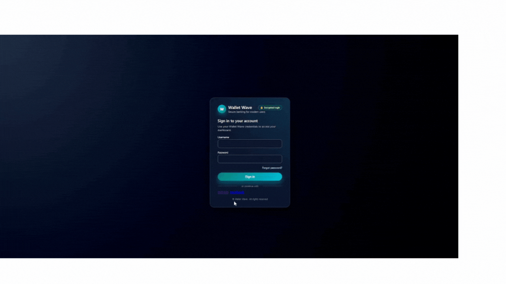
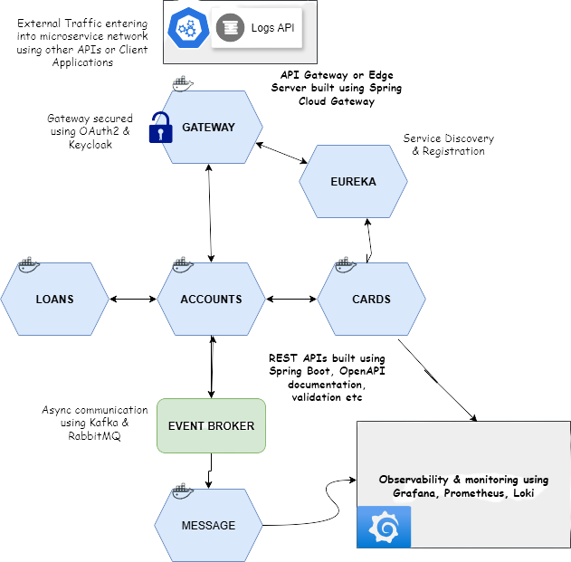
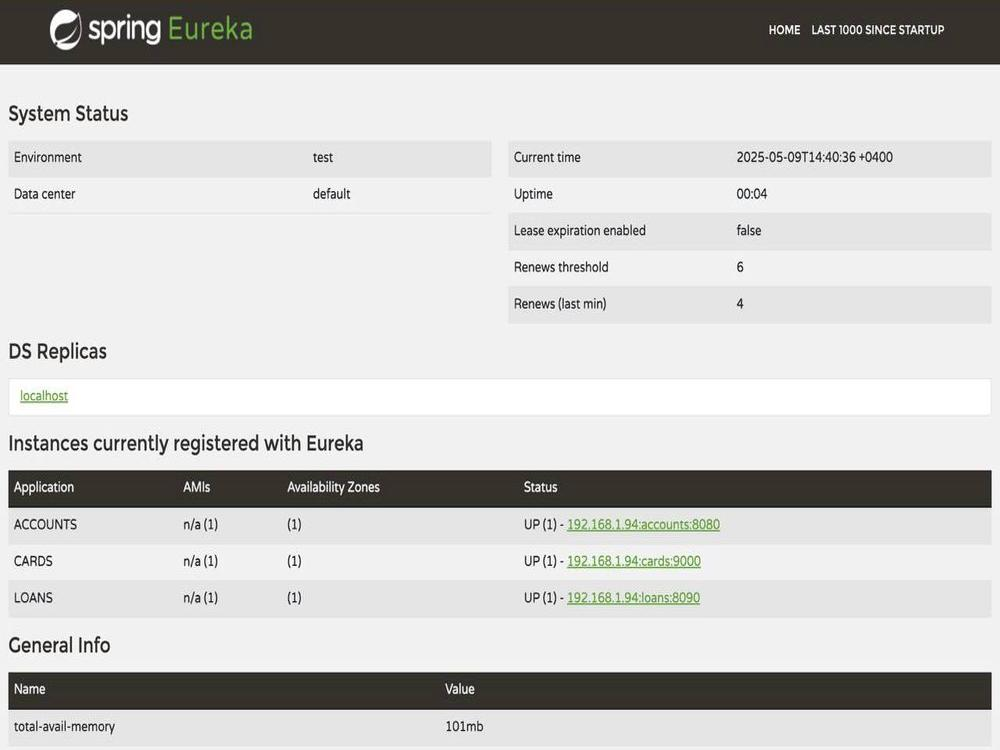
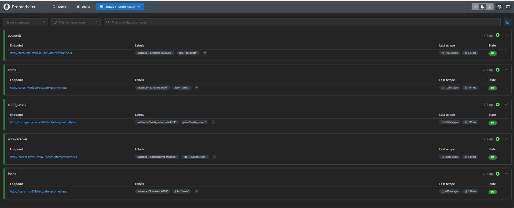
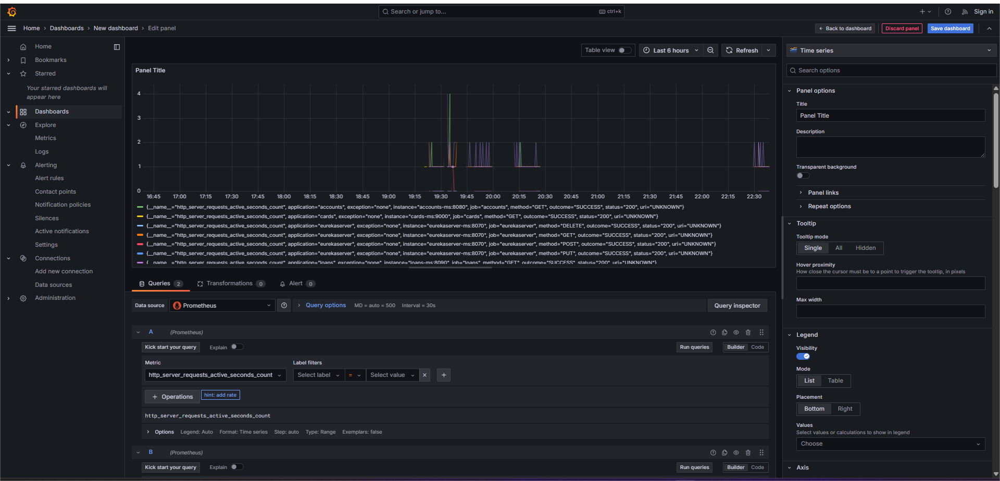
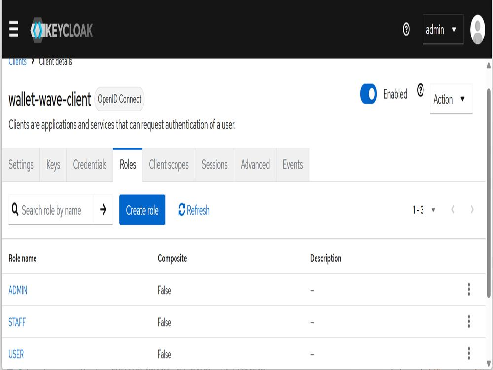
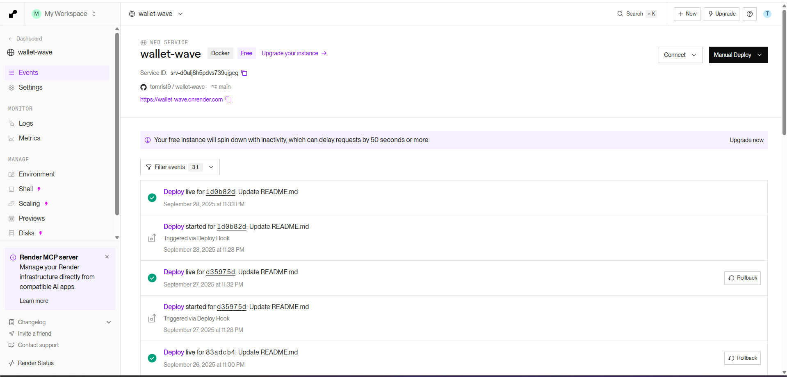

#  Wallet-Wave – Bank Microservices Platform


---

##  Overview

Wallet-Wave is a **production-grade banking application** built with a **microservices architecture** using  
Java, Spring Boot, Docker, and Kubernetes.  
It is designed to deliver **secure, scalable, and resilient** core banking operations for modern financial services.

---

##  Application Demo



##  Architecture



>  **Microservices in Wallet-Wave**

- 🛡️ **Gateway**  
  Routes external traffic to services securely

- ⚙️ **Config Server**  
  Centralized configuration management

  

- **Eureka Server**  
  Service discovery and registration  
  

-  **Service Discovery (Kubernetes Native)**  
  Kubernetes-based service discovery using built-in DNS and Services.  
  This approach replaces Eureka in cloud-native production deployments  
  and provides scalable, resilient inter-service communication.

  🔗 Repo: https://github.com/tomrist9/wallet-wave-service-discovery


-  **Accounts Service**  
  Account management (create, update, delete, fetch)

-  **Cards Service**  
  Manage debit/credit cards, card issuance and operations

-  **Loans Service**  
  Loan operations and management

-  **Message Service**  
  Asynchronous messaging (Kafka / RabbitMQ)


  ##  Observability & Monitoring

Wallet-Wave uses **Spring Boot Actuator**, **Prometheus**, and **Grafana** to provide real-time insight into
microservices health and performance.

### 🔹 Prometheus Targets
Prometheus collects metrics from each service (`/actuator/prometheus`).



### 🔹 Grafana Dashboards
Real-time visualization of HTTP requests, service health and system performance.




---

##  Features

- ✅ **Microservices Architecture** – clearly defined service boundaries  
- ✅ **Spring Boot & Spring Cloud** – production-ready services  
- ✅ **API Gateway** – secure API routing with Spring Cloud Gateway  
- ✅ **Event-Driven Architecture** – RabbitMQ, Kafka, Spring Cloud Stream  
- ✅ **Resilience & Fault Tolerance** – Resilience4J  
- ✅ **Observability & Monitoring** – Prometheus, Grafana, Loki, Promtail, Tempo  
- ✅ **Security & Authentication** – Spring Security, OAuth2 / OIDC, Keycloak
- 
- ✅ **Containerization & Orchestration** – Docker, Kubernetes (Helm charts)  
- ✅ **API Documentation** – Swagger / OpenAPI  

---

##  Deployment (Render)


Wallet-Wave is deployed on **Render** with Dockerized microservices.


https://wallet-wave.onrender.com

---


---

##  Getting Started

### 🔹 Clone the repository
```bash
git clone https://github.com/tomrist9/wallet-wave.git
cd wallet-wave


```bash


